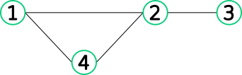
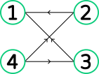

# Devoir 2
*Répondez au questions ci-dessous dans le fichier `graphes.R`. N'hésitez pas à programmer toute fonction auxiliaire vous étant utile.*

L'objectif du devoir 2 est le développement de classes représentant des objets de la théorie des graphes. Un graphe est une paire $(V, E)$ où $V$ et $E$ sont l'ensemble des *sommets* et des *arrêtes* respectivement. En ce qui nous concerne, nous ne nous intéresserons qu'au cas où $V = 1, \ldots n$ pour un $n$ donné. $E$ est composé de paires de sommets, i.e. $E \subseteq V \times V$. Par exemple,



correspond au graphe
```math
(V = \{ 1, 2, 3, 4 \}, E = \{ \{1, 2\}, \{2, 3\}, \{1, 4\}, \{2, 4\} \})
```

On parle de *graphe dirigé* ou *digraphe* lorsque l'ordre des éléments de $E$ est important. Par exemple,



correspond au graphe
```math
(V = \{ 1, 2, 3, 4 \}, E = \{ (2, 1), (3, 1), (4, 2), (4, 3) \}).
```
Les parenthèses sont utilisées pour indiquer que l'ordre des sommets est important.

## Question 1
Impémentez les classes `graph` et `digraph` représentant des graphes et des digraphes respectivement. Pour ce faire, programmez les *constructeurs* appropriés. N'hésitez pas à créer toute autre classe que vous jugez appropriée :wink:.

## Question 2
Implémentez les méthodes suivantes pour `graph` et `digraph`:
- `print`;
- `summary`.

## Question 3
Implémentez les méthodes suivantes pour `graph` et `digraph`:
- `nv`: nombre de sommets;
- `ne`: nombre d'arrêtes/arcs;
- `degree`: degré (# arrêtes/arc incident) d'un sommet;
- `neighbors`: voisins d'un sommet ($u$ est voisin de $v$ si $`\{ u, v \} \in E`$).

Dans le cas d'un digraphe, on considère que $u$ est voisin avec $v$ si $`(u, v) \in E`$ ou $`(v, u) \in E`$.

## Question 4
Pour les digraphes, on distingue le *degré entrant* d'un sommet de son *degré sortant*. Le premier fait référence au nombre d'arcs pour lesquels le sommet est la source versus la destination pour le second. Implémentez les méthodes `indegree` et `outdegree` retournant ces quantités pour un graphe et une sommet donné.

## Question 5
Étant donné un graphe et un sommet source, on peut ordonner les sommets en fonction de leur distance par rapport à la source. Il suffit de faire un [parcour en largeur](https://fr.wikipedia.org/wiki/Algorithme_de_parcours_en_largeur) [breadth-first search](https://en.wikipedia.org/wiki/Breadth-first_search) à partir de la source. Implémentez la méthode `bfs` pour les classes `graph` et `digraph` permettant de faire cela.

## Question 6
Soit $n$ un entier positif et $0 \leq p \leq 1$. Un graphe $G = (V, E)$ suit [le modèle d'Erdos-Rényi](https://en.wikipedia.org/wiki/Erd%C5%91s%E2%80%93R%C3%A9nyi_model) $\mathcal G(n, p)$ si
1. $`\lvert V \rvert = n`$;
2. Chaque $`\{ u, v \} \in V \times V`$ ($`(u, v)`$ pour les digraphes) est inclu dans $E$ avec probabilité $p$.

Implémentez la méthode `rand` pour `graph` et `digraph` qui génère un graphe aléatoire $G$ "semblable" à un graphe $`G' = (V', E')`$. Pour ce faire, votre méthode doit prendre en argument un `graph`/`digraph` et en générer un nouveau selon le modèle
```math
\mathcal G \left( \lvert V' \rvert, \frac{\lvert E' \rvert}{\lvert V' \rvert} \right).
```
