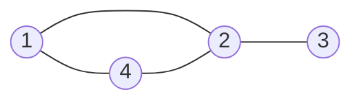
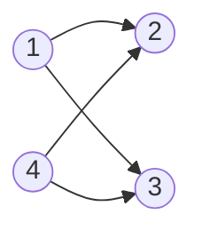

# Devoir 2
*Répondez au questions ci-dessous dans le fichier `graphes.R`.*

L'objectif du devoir 2 est le développement de classes représentant des objets de la théorie des graphes. Un graphe est une paire $(V, E)$ où $V$ et $E$ sont l'ensemble des *sommets* et des *arrêtes* respectivement. En ce qui nous concerne, nous ne nous intéresserons qu'au cas où $V = 1, \ldots n$ pour un $n$ donné. $E$ est composé de paires de sommets, i.e. $E \subseteq V \times V$. Par exemple,

correspond au graphe
```math
(V = \{ 1, 2, 3, 4 \}, E = \{ \{1, 2\}, \{2, 3\}, \{1, 4\}, \{2, 4\} \})
```

On parle de *graphe dirigé* ou *digraphe* lorsque l'ordre des éléments de $E$ est important. Par exemple,

correspond au graphe
```math
(V = \{ 1, 2, 3, 4 \}, E = \{ (1, 2), (1, 3), (4, 2), (4, 3) \}).
```
Les parenthèses sont utilisées pour indiquer que l'ordre des sommets est important.

## Question 1
Impémentez les classes `graph` et `digraph` représentant des graphes et des digraphes respectivement. Pour ce faire, programmez les *constructeurs* appropriés. N'hésitez pas à créer toute autre classe que vous jugez appropriée :wink:.

## Question 2
Implémentez les méthodes suivantes pour `graph` et `digraph`:
- `print`;
- `summary`.

